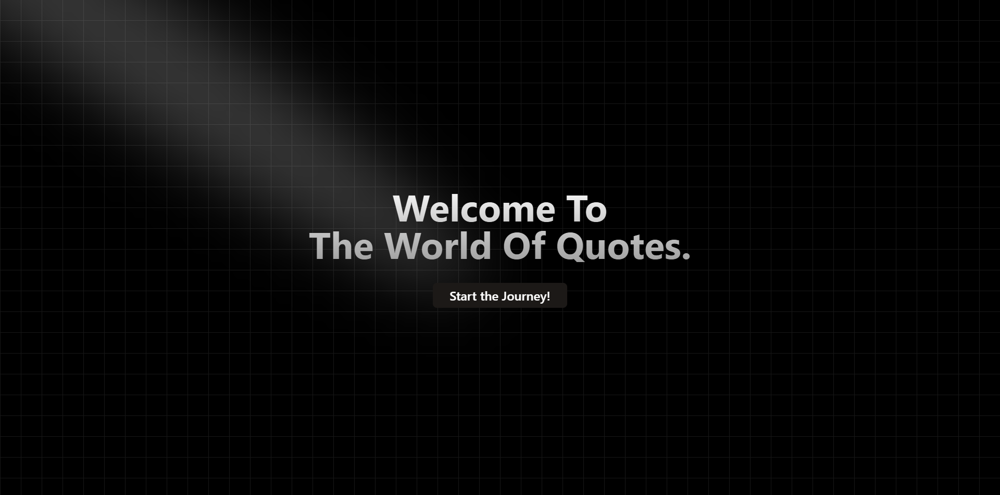

# Quote Generator Web App

A modern, interactive web application for generating and exploring inspirational quotes, built as part of the Nexium AI-First Web Development Internship 2025.

## Table of Contents

- [Overview](#overview)
- [Features](#features)
- [Screenshots](#screenshots)
- [Getting Started](#getting-started)
- [Usage](#usage)
- [License](#license)

## Overview

This project is a Next.js-based web app that allows users to generate, view, and explore a variety of motivational and inspirational quotes. The app features a clean UI, topic-based navigation, and interactive components for an engaging user experience.

## Features

- Generate random quotes with a single click
- Browse quotes by topic or category
- Responsive and modern UI
- Built with Next.js, TypeScript, and Tailwind CSS
- Modular and reusable React components

## Screenshots



## Getting Started

### Prerequisites

- Node.js (v18 or higher recommended)

### Installation

1. Clone the repository:
   ```bash
   git clone https://github.com/SanaUllah04/Quote-Generator-Web-App.git
   cd quote-generator-web-app/web-quote-generator-sanaullah
   ```

2. Install dependencies:
   ```bash
   npm install

   ```

3. Run the development server:
   ```bash
   npm run dev

   ```

4. Open [http://localhost:3000](http://localhost:3000) in your browser to view the app.


## Usage

- Click the "Start the Journey!" Button.
- Copy & Paste a topic or Write it Manually.
- Click the "Generate Quote" button or simple press "Enter", to get a new random quote.


## License

This project is licensed under the MIT License.

